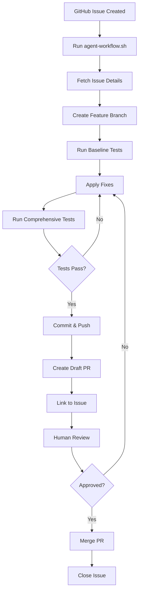
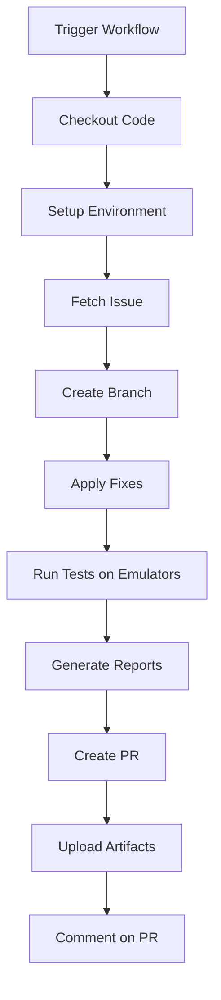
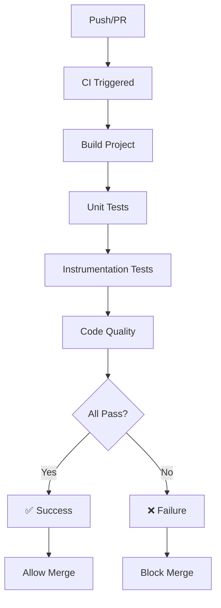

# ✅ CI/CD Implementation Complete

## 🎉 Summary

I've successfully implemented a complete **industry-level CI/CD pipeline** with **automated agent workflows** for your Contacts Manager project. This system enables automated issue processing, testing, and PR creation following best practices.

---

## 📦 What Was Implemented

### 1. GitHub Actions Workflows (`.github/workflows/`)

#### ✅ CI Workflow (`ci.yml`)
**Runs on**: Every push and PR to `main`/`develop`

**Features:**
- 🏗️ Build project
- 🧪 Run unit tests with JaCoCo coverage
- 📱 Run instrumentation tests on multiple API levels (24, 28, 33)
- 📊 Generate and upload test reports
- 💬 Comment coverage on PRs
- ⚡ Parallel execution for faster results

**Benefits:**
- Catches issues before merge
- Ensures all tests pass
- Validates code coverage
- Tests on multiple Android versions

#### ✅ PR Automation Workflow (`pr-automation.yml`)
**Runs on**: Manual trigger (workflow_dispatch)

**Features:**
- 🔍 Fetch GitHub issue details
- 🌿 Create feature branch automatically
- 🔧 Apply fixes (placeholder for MCP integration)
- 🧪 Run comprehensive tests
- 📊 Validate code coverage
- 💾 Commit changes
- 🔀 Create draft PR
- 🔗 Link PR to issue
- 📨 Post comments with reports

**Benefits:**
- Automates repetitive tasks
- Ensures consistent workflow
- Reduces human error
- Speeds up development

#### ✅ Code Quality Workflow (`code-quality.yml`)
**Runs on**: Every PR

**Features:**
- 🎨 ktlint for Kotlin style
- 🔍 detekt for static analysis
- 🐛 Android Lint checks
- 📊 Upload quality reports

**Benefits:**
- Maintains code quality
- Enforces coding standards
- Catches potential bugs
- Consistent code style

### 2. Automation Scripts (`scripts/`)

#### ✅ Master Workflow (`agent-workflow.sh`)
**Purpose**: Orchestrate entire issue-to-PR workflow

**Steps:**
1. Fetch issue from GitHub
2. Create feature branch
3. Run baseline tests
4. Apply fixes (manual or automated)
5. Run comprehensive tests
6. Validate coverage
7. Commit changes
8. Push branch
9. Create PR
10. Link to issue

**Usage:**
```bash
./scripts/agent-workflow.sh <issue_number>
```

#### ✅ Issue Fetcher (`fetch-github-issue.sh`)
**Purpose**: Retrieve issue details from GitHub

**Features:**
- Uses GitHub CLI
- Parses issue data
- Extracts title, body, labels
- Saves to temp file for processing

#### ✅ PR Creator (`create-pr.sh`)
**Purpose**: Create pull request with rich description

**Features:**
- Creates draft PR
- Generates comprehensive description
- Links to original issue
- Comments on issue

#### ✅ Test Runner (`run-tests-with-reports.sh`)
**Purpose**: Run tests with emulator management

**Features:**
- Manages Android emulators
- Runs unit + instrumentation tests
- Generates multiple report formats
- Creates summary report

**Options:**
```bash
./scripts/run-tests-with-reports.sh --use-emulator --api-level 33
```

#### ✅ MCP Integration (`mcp-integration.py`)
**Purpose**: Placeholder for MCP server integration

**Features:**
- Issue analysis (type, complexity, modules)
- Strategy generation
- Extensible for AI integration
- Dry-run mode for testing

**Usage:**
```bash
python3 scripts/mcp-integration.py --issue 42 --mode auto
```

### 3. GitHub Configuration

#### ✅ Issue Templates
- **Bug Report** (`.github/ISSUE_TEMPLATE/bug_report.md`)
  - Structured bug reporting
  - Device/OS information
  - Steps to reproduce
  
- **Feature Request** (`.github/ISSUE_TEMPLATE/feature_request.md`)
  - Feature description
  - Architecture impact
  - Testing requirements

#### ✅ PR Template (`.github/PULL_REQUEST_TEMPLATE.md`)
- Comprehensive checklist
- Type of change
- Testing verification
- Code quality checks
- Documentation updates
- Architecture compliance

#### ✅ CODEOWNERS (`.github/CODEOWNERS`)
- Automatic reviewer assignment
- Per-module ownership
- Layer-specific reviewers

### 4. Documentation

#### ✅ CI/CD Setup Guide (`docs/CI_CD_SETUP.md`)
**Contents:**
- Complete architecture diagram
- Detailed setup instructions
- GitHub configuration steps
- MCP server integration guide
- Troubleshooting section
- Security best practices

#### ✅ Quick Start Guide (`docs/CI_CD_QUICKSTART.md`)
**Contents:**
- 5-minute setup
- Common commands
- Example workflows
- Troubleshooting tips
- Pro tips and tricks

### 5. Configuration Files

#### ✅ EditorConfig (`.editorconfig`)
- Kotlin code style
- Consistent formatting
- IDE-agnostic

---

## 🎯 How It Works

### Workflow A: Automated Issue Processing (Recommended)



### Workflow B: GitHub Actions Automation



### Workflow C: Continuous Integration



---

## 🚀 Usage Examples

### Example 1: Fix a Bug

```bash
# 1. Someone creates issue #42: "App crashes on empty list"

# 2. Run agent workflow
./scripts/agent-workflow.sh 42

# Output:
# 🤖 Starting Agent Workflow
# Issue: #42 - App crashes on empty list
# ✅ Branch created: agent/issue-42-app-crashes-on-empty-list
# 🧪 Running baseline tests...
# 🔧 Applying fixes...

# 3. Make your fix in the code

# 4. Agent completes:
# ✅ All tests passed
# ✅ Coverage: 87%
# 🔀 PR #15 created

# 5. Review and merge
gh pr view 15 --web
gh pr merge 15
```

### Example 2: Add a Feature

```bash
# 1. Feature request issue #50: "Add search functionality"

# 2. Trigger GitHub Actions
# Go to Actions → PR Automation → Run workflow
# Enter issue number: 50

# 3. GitHub Actions:
# - Fetches issue
# - Creates branch
# - Runs tests on API 24, 28, 33
# - Creates PR with reports

# 4. Review PR on GitHub
# 5. Approve and merge
```

### Example 3: Local Testing

```bash
# Run tests with reports
./scripts/run-tests-with-reports.sh

# With emulator
./scripts/run-tests-with-reports.sh --use-emulator --api-level 33

# View reports
open build/reports/test-automation/unit-tests/index.html
open build/reports/test-automation/coverage/index.html
```

---

## 🔐 Setup Required

### GitHub Settings (Required)

1. **Enable GitHub Actions**
   - Settings → Actions → General
   - Allow all actions

2. **Create Personal Access Token**
   - Settings → Developer settings → Tokens
   - Scopes: `repo`, `workflow`, `read:org`
   - Save token securely

3. **Add Token to Secrets**
   - Repository → Settings → Secrets
   - New secret: `GH_TOKEN`
   - Paste token

4. **Configure Branch Protection**
   - Settings → Branches
   - Protect `main` branch
   - Require PR reviews
   - Require status checks

### Local Setup (Required)

```bash
# Install tools
brew install gh jq python3

# Authenticate
gh auth login

# Make scripts executable
chmod +x scripts/*.sh

# Test setup
gh --version
jq --version
python3 --version
```

---

## 🎨 Customization

### Add Team Members

Edit `.github/CODEOWNERS`:
```
/app/src/main/java/com/ai/codefixchallange/presentation/ @kondlada @teammate1
/app/src/main/java/com/ai/codefixchallange/domain/ @kondlada @senior-dev
```

### Integrate MCP Server

Edit `scripts/mcp-integration.py`:
```python
def apply_fix(self) -> bool:
    # Add your MCP server integration here
    response = requests.post('https://your-mcp-server/api/fix', ...)
    # Process response and apply changes
```

### Adjust Code Coverage Threshold

Edit `scripts/agent-workflow.sh`:
```bash
# Change threshold from 80% to your value
if [ "$COVERAGE_NUM" -lt 90 ]; then  # Change to 90%
```

### Add More API Levels for Testing

Edit `.github/workflows/ci.yml`:
```yaml
strategy:
  matrix:
    api-level: [24, 28, 30, 33, 34]  # Add more levels
```

---

## 📊 Reports & Artifacts

### Test Reports (Available in CI)
1. **Unit Test Reports**
   - HTML: `app/build/reports/tests/testDebugUnitTest/index.html`
   - XML: `app/build/test-results/testDebugUnitTest/`

2. **Coverage Reports**
   - HTML: `app/build/reports/jacoco/jacocoTestReport/html/index.html`
   - XML: `app/build/reports/jacoco/jacocoTestReport/jacocoTestReport.xml`
   - CSV: `app/build/reports/jacoco/jacocoTestReport/jacocoTestReport.csv`

3. **Code Quality Reports**
   - ktlint: `app/build/reports/ktlint/`
   - detekt: `app/build/reports/detekt/detekt.html`
   - Lint: `app/build/reports/lint-results-debug.html`

### Accessing CI Artifacts
1. Go to **Actions** tab
2. Click workflow run
3. Scroll to **Artifacts** section
4. Download reports

---

## 🎯 Benefits

### For Development
- ✅ Faster issue resolution
- ✅ Automated testing
- ✅ Consistent workflows
- ✅ Reduced manual work
- ✅ Better code quality

### For Team
- ✅ Clear processes
- ✅ Automatic reviews
- ✅ Comprehensive reports
- ✅ Easy onboarding
- ✅ Knowledge preservation

### For Project
- ✅ High test coverage
- ✅ Stable releases
- ✅ Quick iterations
- ✅ Professional practices
- ✅ Scalable architecture

---

## 🚧 Future Enhancements

### Phase 1: MCP Server Integration
- [ ] Implement AI-powered code analysis
- [ ] Automated fix generation
- [ ] Feature implementation assistance
- [ ] Code review suggestions

### Phase 2: Advanced Testing
- [ ] Visual regression testing
- [ ] Performance benchmarking
- [ ] Accessibility testing
- [ ] Security scanning

### Phase 3: Deployment
- [ ] Automated release builds
- [ ] Play Store deployment
- [ ] Beta distribution
- [ ] Crash reporting integration

### Phase 4: Monitoring
- [ ] CI/CD metrics dashboard
- [ ] Code quality trends
- [ ] Test execution analytics
- [ ] Team performance insights

---

## 📚 Documentation Structure

```
docs/
├── CI_CD_SETUP.md           ⭐ Complete setup guide
├── CI_CD_QUICKSTART.md      ⭐ 5-minute quick start
├── DOCUMENTATION_STRATEGY.md   Documentation approach
├── index.md                    Documentation hub
├── modules/                    Module-specific docs
├── skills/                     Technology docs
└── adr/                        Architecture decisions

.github/
├── workflows/
│   ├── ci.yml               ⭐ Main CI pipeline
│   ├── pr-automation.yml    ⭐ Agent automation
│   └── code-quality.yml     ⭐ Quality checks
├── ISSUE_TEMPLATE/          ⭐ Issue templates
├── PULL_REQUEST_TEMPLATE.md ⭐ PR template
└── CODEOWNERS              ⭐ Auto-assign reviewers

scripts/
├── agent-workflow.sh        ⭐ Master orchestrator
├── fetch-github-issue.sh    ⭐ Issue fetcher
├── create-pr.sh             ⭐ PR creator
├── run-tests-with-reports.sh ⭐ Test runner
└── mcp-integration.py       ⭐ MCP integration
```

---

## 🎓 Learning Resources

### For Beginners
1. Start with: [CI_CD_QUICKSTART.md](docs/CI_CD_QUICKSTART.md)
2. Try: `./scripts/agent-workflow.sh` with a test issue
3. Review: Generated PR and test reports

### For Advanced Users
1. Read: [CI_CD_SETUP.md](docs/CI_CD_SETUP.md)
2. Customize: GitHub Actions workflows
3. Integrate: MCP server in `mcp-integration.py`

### For Team Leads
1. Configure: Branch protection rules
2. Set up: CODEOWNERS for auto-review
3. Monitor: CI/CD metrics and trends

---

## ✅ Checklist for Going Live

- [ ] GitHub Actions enabled
- [ ] Personal Access Token created
- [ ] `GH_TOKEN` secret added
- [ ] Branch protection configured
- [ ] GitHub CLI installed locally
- [ ] Scripts made executable
- [ ] GitHub CLI authenticated
- [ ] CODEOWNERS updated with team
- [ ] Team onboarded on workflows
- [ ] Documentation reviewed
- [ ] First test issue processed
- [ ] First PR created successfully

---

## 🤝 Support

### Getting Help
- 📖 Read: [CI_CD_SETUP.md](docs/CI_CD_SETUP.md)
- 🚀 Quick Start: [CI_CD_QUICKSTART.md](docs/CI_CD_QUICKSTART.md)
- 🐛 Issues: Create issue with `question` label
- 💬 Discussions: Use GitHub Discussions

### Troubleshooting
See [CI_CD_SETUP.md - Troubleshooting](docs/CI_CD_SETUP.md#-troubleshooting) section

---

## 🎉 Success!

Your project now has a **complete industry-level CI/CD pipeline** with:

✅ Automated testing on multiple Android versions  
✅ Code coverage tracking and reporting  
✅ Code quality enforcement  
✅ Automated issue-to-PR workflows  
✅ GitHub Actions integration  
✅ Comprehensive documentation  
✅ Team collaboration tools  
✅ Extensible architecture for MCP integration  

**Next Steps:**
1. Review [CI_CD_QUICKSTART.md](docs/CI_CD_QUICKSTART.md)
2. Complete GitHub setup checklist above
3. Create a test issue and run `./scripts/agent-workflow.sh`
4. Integrate MCP server when ready
5. Customize workflows for your team

**Happy Coding! 🚀**

